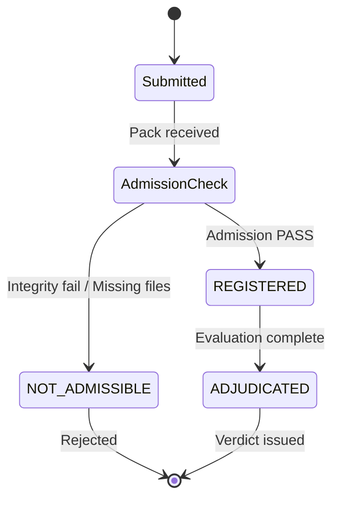
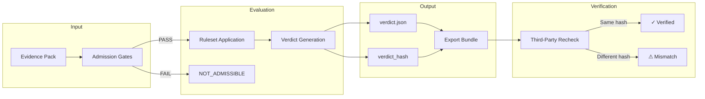
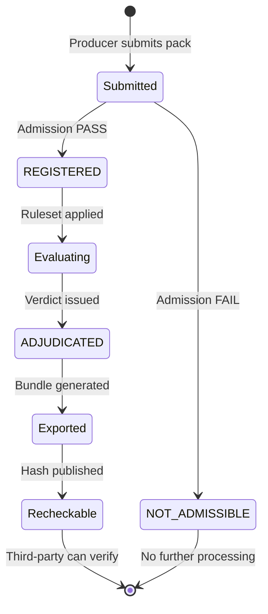

# METHOD-VLAB-01: Validation Lab Evaluation Methodology

> **Document ID**: METHOD-VLAB-01  
> **Version**: 1.0  
> **Site Version**: site-v0.5  
> **Status**: Frozen  
> **Last Updated**: 2026-01-20

---

## Document Type

**Non-normative / Informative** — This document explains the Validation Lab's evidence-based evaluation methodology. It is authoritative for Lab procedures but does NOT define MPLP Protocol semantics.

---

## 1. Purpose & Boundaries

The MPLP Validation Lab provides **evidence-based verdicts** for lifecycle guarantees under versioned, deterministic rulesets.

### Four Boundaries (Non-Negotiable)

| Boundary | Description |
|:---|:---|
| **Non-certification** | No badges, rankings, or compliance certificates |
| **Non-endorsement** | Verdict ≠ recommendation or quality assessment |
| **No execution hosting** | Lab does not run your code; you provide evidence packs |
| **Deterministic ruleset** | Same evidence + same ruleset = same verdict |

> **Reference**: [About Page](/about) — Full boundary statement

---

## 2. What Is Being Evaluated

### Evaluation Object

We evaluate **Evidence Packs** against **Lifecycle Guarantees (LG-01~05)** using **frozen Rulesets**.

```
Evidence Pack + Ruleset → Verdict (PASS/FAIL/SKIP) + verdict_hash
```

### What We DO NOT Evaluate

- ❌ Runtime performance or latency
- ❌ Agent quality, capability, or intelligence
- ❌ Framework feature completeness
- ❌ Code correctness or security
- ❌ Business suitability or compliance

---

## 3. Inputs: Evidence Pack

### Definition

An **Evidence Pack** is a self-contained artifact bundle submitted for evaluation. It must conform to the [Export Contract](/policies/contract).

### Required Structure (pack-v0.2+)

```
pack/
├── manifest.json            # Pack metadata
├── integrity/
│   ├── sha256sums.txt       # File checksums
│   └── pack.sha256          # Pack root hash
├── timeline/
│   └── events.ndjson        # Execution timeline
└── artifacts/
    ├── context.json         # Agent context
    ├── plan.json            # Agent plan
    └── trace.json           # Execution trace
```

### Pack Format Versions

| Version | Description |
|:---|:---|
| `pack-v0.2` | GoldenFlow format (GF-01~05) |
| `pack-v0.3` | Four-Domain format (D1~D4) |
| `pack-v0.4` | Semantic Invariant format (12 clauses) |

> **Reference**: [Export Contract](/policies/contract) — Full pack specification

---

## 4. Admission: Evidence Intake

### Admission Process

Before substantive evaluation, every pack undergoes **admission checks**:



### Admission Status Values

| Status | Meaning |
|:---|:---|
| `REGISTERED` | Pack admitted, awaiting or undergoing evaluation |
| `NOT_ADMISSIBLE` | Pack rejected due to structural/integrity failure |
| `ADJUDICATED` | Evaluation complete, verdict issued |

### Why Packs Get Rejected

- Missing required files (manifest.json, sha256sums.txt)
- Integrity hash mismatch
- Schema validation failure
- Unsupported pack format version

> **Reference**: [Intake Policy](/policies/intake) — Full admission criteria

---

## 5. Rulesets: Evaluation Criteria

### Definition

A **Ruleset** is a versioned, immutable set of decision rules that determine verdicts.

### Current Rulesets

| Ruleset | Format | Scope |
|:---|:---|:---|
| `ruleset-1.0` | GoldenFlow (LG-01~05) | pack-v0.2 |
| `ruleset-1.1` | Four-Domain (D1~D4) | pack-v0.3 |
| `ruleset-1.2` | Semantic Invariant (12 clauses) | pack-v0.4 |

### Ruleset Immutability

Once frozen, a ruleset **never changes**. New evaluation criteria require a new ruleset version.

```
ruleset-1.0 frozen → verdict_hash stable forever
```

> **Reference**: [Rulesets](/rulesets) — All ruleset versions

---

## 6. Verdicts: Evaluation Output

### Verdict Structure

```json
{
  "verdict_hash": "sha256:abc123...",
  "overall_status": "PASS",
  "ruleset_version": "1.0",
  "evaluated_at": "2026-01-20T00:00:00Z",
  "requirements": [
    { "id": "RQ-GF-01-01", "status": "PASS" },
    { "id": "RQ-GF-01-02", "status": "PASS" }
  ]
}
```

### Verdict Status Values

| Status | Meaning |
|:---|:---|
| `PASS` | All applicable requirements satisfied |
| `FAIL` | One or more requirements not satisfied |
| `SKIP` | Requirement not applicable to this pack |

### verdict_hash

The `verdict_hash` is a deterministic SHA-256 hash computed from:
- Pack content hash
- Ruleset version
- Evaluation logic version

**Same pack + same ruleset = same verdict_hash** (reproducibility guarantee)

---

## 7. Recheck: Third-Party Verification

### Determinism Guarantee

Anyone can verify a verdict independently:

```bash
npx @mplp/recompute <pack_path> --ruleset 1.0
```

### Recheck Conditions

For identical `verdict_hash`, the following must be constant:
- Evidence pack content (byte-identical)
- Ruleset version
- Recompute CLI version

### Why Recheck Matters

- **Trustless verification**: No need to trust Lab infrastructure
- **Auditability**: Third parties can confirm verdicts
- **Reproducibility**: Same input always produces same output

> **Reference**: [Third-Party Verification](/docs/third-party-verification.md)

---

## 8. Substrate Model

### Definition

A **Substrate** is an execution environment (framework, protocol, or runtime) that produces evidence packs.

### SSOT Declaration

> [!IMPORTANT]
> **Live SSOT**: `data/curated-runs/substrate-index.yaml`  
> This document provides methodology context only. For current substrate registry status, always refer to the SSOT.

### Claim Levels

| Level | Definition |
|:---|:---|
| **Declared** | Substrate author claims capability |
| **Reproduced** | Lab can reproduce evidence from published steps |
| **Cross-Verified** | Multiple independent runs produce equivalent verdicts |

### Tier System

| Tier | Criteria |
|:---|:---|
| **Tier 0** | Primary evaluation targets (frameworks + protocols) |
| **Tier 99** | Fixture/simulation for testing (internal) |

### Tier-0 Substrate Snapshot

> **Snapshot**: `site-v0.5 / rel-lab-0.5` (2026-01-20)  
> **Source**: `data/curated-runs/substrate-index.yaml`  
> If this table differs from SSOT, SSOT takes precedence.

| Substrate | Type | Status |
|:---|:---|:---|
| LangChain | framework | ✅ ADJUDICATED |
| MCP | protocol | ✅ ADJUDICATED |
| LangGraph | framework | ⚪ REGISTERED |
| AutoGen | framework | ⚪ REGISTERED |
| Semantic Kernel | framework | ⚪ REGISTERED |
| A2A | protocol | ⚪ REGISTERED |

> **Reference**: [Substrate Scope Policy](/policies/substrate-scope) — Admission tiers

---

## 9. Version Taxonomy

The Validation Lab uses **four distinct version types**:

| Type | Prefix | Current | Scope |
|:---|:---|:---|:---|
| **Site Freeze** | `site-v*` | `site-v0.5` | Website IA and public commitment |
| **Pack Format** | `pack-v*` | `pack-v0.2~0.4` | Evidence pack structure |
| **Ruleset** | `ruleset-*` | `ruleset-1.0~1.2` | Evaluation decision rules |
| **Release Seal** | `rel-lab-*` | `rel-lab-0.5` | Governance seal version |

### Pinning Relationships

```
site-v0.5 
  └── supports: pack-v0.2, pack-v0.3, pack-v0.4
  └── uses: ruleset-1.0, ruleset-1.1, ruleset-1.2
  └── sealed by: rel-lab-0.5
```

---

## 10. Non-Goals (What We Don't Do)

| Non-Goal | Explanation |
|:---|:---|
| **Adapters / SDKs** | We don't provide official integration code |
| **Execution Hosting** | We don't run your agents |
| **Ranking / Scoring** | Verdicts are PASS/FAIL, not ranked |
| **Certificates** | No compliance badges or credentials |
| **Endorsement** | Verdict ≠ recommendation |
| **Consulting** | No implementation guidance |

---

## Evidence Chain



---

## Case Lifecycle



---

## Quick Reference Links

| Topic | Page |
|:---|:---|
| **Boundaries** | [/about](/about) |
| **Pack Contract** | [/policies/contract](/policies/contract) |
| **Intake** | [/policies/intake](/policies/intake) |
| **Substrate Scope** | [/policies/substrate-scope](/policies/substrate-scope) |
| **Rulesets** | [/rulesets](/rulesets) |
| **Guarantees** | [/guarantees](/guarantees) |
| **Coverage** | [/coverage/adjudication](/coverage/adjudication) |
| **Adjudication** | [/adjudication](/adjudication) |

---

## Document Governance

| Property | Value |
|:---|:---|
| **SSOT Location** | `governance/METHOD-VLAB-01_EVALUATION_METHOD.md` |
| **Website Projection** | `/methodology` (future) |
| **Approval** | rel-lab-0.5 |
| **Next Review** | site-v0.6 |
