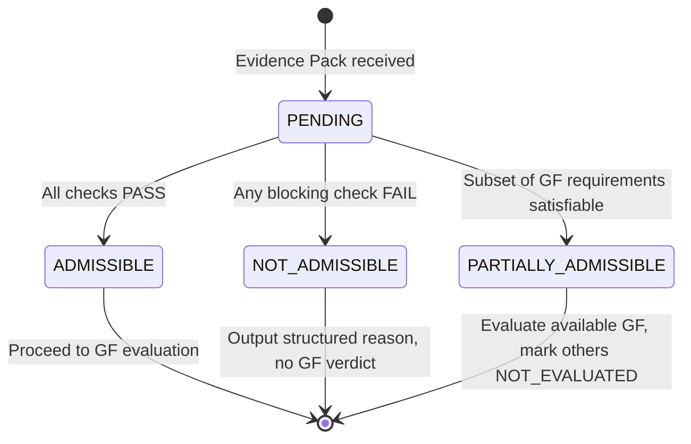

# Admission Criteria Contract v1.0

**Contract ID**: VLAB-CONTRACT-ADMISSION-01  
**Status**: GOVERNANCE-FROZEN  
**Effective Date**: 2026-01-09  
**Governed By**: VLAB-DGB-01

---

## Purpose

This contract defines the **admission criteria** for Evidence Packs in Validation Lab.
Admission determines whether an Evidence Pack can proceed to GF evaluation.

---

## Admission State Machine



> [!NOTE]
> `PENDING` is an **internal transient state** used for processing flow visualization only.
> It MUST NOT appear in emitted admission results or API outputs.

---

## Admission Status Definitions

| Status | Definition | Next Action |
|:---|:---|:---|
| `ADMISSIBLE` | All admission checks passed | → Proceed to full GF evaluation |
| `NOT_ADMISSIBLE` | One or more blocking checks failed | → Output structured reason with taxonomy, no GF verdict |
| `PARTIALLY_ADMISSIBLE` | Only subset of GF requirements satisfiable | → Evaluate available GF, mark others as NOT_EVALUATED |

> [!IMPORTANT]
> **v1.0 Simplification**
>
> `PARTIALLY_ADMISSIBLE` is optional for v1.0 implementation.
> If not implemented, use `ADMISSIBLE` + individual GF `NOT_EVALUATED` verdicts.

---

## Admission Check Categories

> **Execution Order**: The actual check execution order is defined in [Admission Check Order](#admission-check-order) below.
> This section categorizes checks by type, not execution sequence.

### Check 1: Integrity Verification (BLOCKING)

| Check | Pass Condition | Fail → Taxonomy |
|:---|:---|:---|
| Manifest exists | `manifest.json` present in pack root | `MANIFEST_INVALID_OR_INCOMPLETE` |
| Manifest schema valid | Validates against manifest schema | `MANIFEST_INVALID_OR_INCOMPLETE` |
| Hash verification | All declared hashes match computed | `INTEGRITY_HASH_MISMATCH` |

### Check 2: Version Compatibility (BLOCKING)

| Check | Pass Condition | Fail → Taxonomy |
|:---|:---|:---|
| Protocol version declared | `manifest.protocol_version` present | `MANIFEST_INVALID_OR_INCOMPLETE` |
| Protocol version compatible | Version in supported range (1.0.x) | `VERSION_INCOMPATIBLE` |
| Ruleset version compatible | Declared ruleset exists | `VERSION_INCOMPATIBLE` |

### Check 3: Security Constraints (BLOCKING)

| Check | Pass Condition | Fail → Taxonomy |
|:---|:---|:---|
| No path traversal | No `../` or absolute paths in archive | `EVIDENCE_PACK_PATH_TRAVERSAL` |
| File type whitelist | Only allowed extensions (see below) | `EVIDENCE_PACK_INVALID_FILE_TYPE` |
| Size limits | Within declared limits | `EVIDENCE_PACK_SIZE_EXCEEDED` |
| No executables | No executable files or `node_modules/` | `EVIDENCE_PACK_SECURITY_REJECTED` |

#### Allowed File Extensions

```
.json, .ndjson, .yaml, .yml, .txt, .md
```

#### Size Limits

| Limit | Value |
|:---|:---|
| Single file max | 10 MB |
| Total pack max | 100 MB |
| Max file count | 1000 files |

### Check 4: Required Artifacts (NON-BLOCKING if partial)

| Artifact | Required for GF |
|:---|:---|
| `context.json` | GF-01, GF-02, GF-03, GF-04, GF-05 |
| `plan.json` | GF-01, GF-02, GF-03, GF-04, GF-05 |
| `confirm.json` | GF-03 |
| `trace.json` or `timeline/events.ndjson` | GF-01, GF-04 |
| `snapshots/` | GF-04 |

> If an artifact required for a specific GF is missing, that GF verdict becomes `NOT_EVALUATED`.

---

## Admission Check Order

1. **Security checks** — Must pass before any file parsing
2. **Manifest existence** — Must exist before schema validation
3. **Manifest schema** — Must pass before version checks
4. **Integrity hashes** — Must pass before content parsing
5. **Version compatibility** — Must pass before GF evaluation
6. **Required artifacts** — Determines which GF can be evaluated

---

## Failure Response Structure

When admission fails (`NOT_ADMISSIBLE`), output MUST include:

```typescript
interface AdmissionFailure {
  status: 'NOT_ADMISSIBLE';
  timestamp: string;  // ISO 8601
  checks_performed: number;
  checks_passed: number;
  failures: AdmissionCheckFailure[];
}

interface AdmissionCheckFailure {
  check_id: string;           // e.g., "INTEGRITY_HASH"
  taxonomy: FailureTaxonomy;  // e.g., "INTEGRITY_HASH_MISMATCH"
  message: string;            // Human-readable description
  pointer?: EvidencePointer;  // If applicable
}
```

---

## Contract Versioning

| Version | Changes |
|:---|:---|
| 1.0.0 | Initial release |

---

## Amendment Process

Changes to admission criteria require:
1. VLAB-DGB-01 governance review
2. Impact assessment on existing evidence packs
3. Version bump (minor for additions, major for removals)

---

**Document Status**: Contract Frozen  
**Version**: 1.0.0
